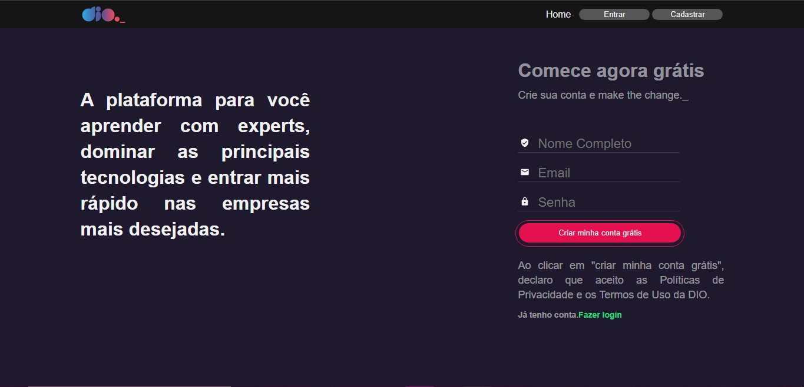

# Clone DIO
Projeto de um clone das páginas de navegação da DIO, incluindo a Homepage, Login, Feed e Cadastro, que era o terceiro desafio do Bootcamp Orange Tech+.



----

## 👩‍💻 O Projeto

Nos foi proposto que criássemos a página de cadastro da plataforma da DIO, utilizando React e Styled Components. Optei por desenvolver em Typescript para treinar e reforçar minhas habilidades na linguagem.

----

## 🔧 Tecnologias Usadas

- HTML
- TSX
- Typescript
- React
- Styled Components
- Axios

## 🔗 Acesso 

Para acessar a Wiki, basta <a href="https://clone-dio-kappa.vercel.app/">clicar aqui</a>!

----

## 💻 Para Rodar o projeto na sua máquina

- Para rodar o projeto local:

1 Clone o repositório
```
    git clone https://github.com/ssschneider/clone-dio.git
```

2 Baixe todos os pacotes necessários
```
    npm install
```

3 Rode o projeto
```
    npm start
```

4 Deixe o banco de dados rodando
```
    npm run api
```

- Caso você queira se inserir no banco de dados: 

1 Siga os passos acima

2 Abra o arquivo "db.json"

3 Crie um novo objeto dentro do array de usuários conforme os modelos

## 🤳 Demo

| Versão Desktop |
| -------------- |
|  |